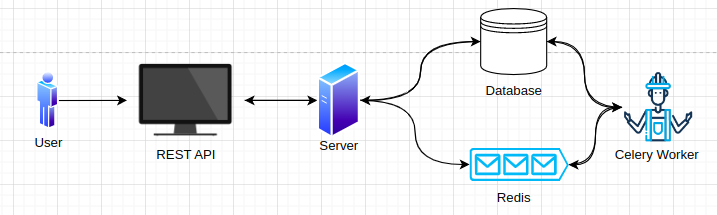

# Thumbnail Generator
Thumbnail generator is JSON-based REST API service which resizes images into 100x100px thumbnails. It supports five type of images which are **PNG, JPEG, JPG, TIFF, BMP and GIF.** You can give your image as input to the api and can retrieve the converted thumbnail after the conversion is completed from the api. Below all the endpoints and how to use them is mentioned.

## How to run and test

To run the service you just need to run a single command i.e. **`docker-compose up`**. All the required services will be automatically created and start running with this command and the API service will be up and running on `http://localhost:8000/`. Then you can use and test the endpoints using postman or the curl examples given below.  Images for testing are also available in a folder named as **`test_images`** in the root directory.

To run the test cases you can run command **`docker-compose run test`** and all test cases will run and show **`OK`** if all test passes else it will show **`FAILED.`**

##### Perquisites

* Docker
* Docker Compose

## API Endpoints

| HTTP Method | Endpoint                                     |
| ----------- | -------------------------------------------- |
| POST        | `api/v1/thumbnail_generator/`              |
| GET         | `api/v1/thumbnail_generator/<str:task_id>` |

#### `api/v1/thumbnail_generator/`

This endpoint supports **`POST`** method and it is used to upload the image which you want to convert. Image can be uploaded by making a **`POST`** request with **`form-data`** including a key value pair with `"image"` key and an image (available in the `test_images` folder) as it's value. After successful submission you will receive a `task_id` which you can later use to retrieve the converted image from the other endpoint.

###### Curl

```bash
curl --location --request POST 'http://localhost:8000/api/v1/thumbnail_generator/' \
--form 'image=@"/path/to/image"'
```

#### `api/v1/thumbnail_generator/<str:task_id>`

This endpoint supports **`GET`** method and it is used to retrieve the converted image. Image can be retrieved by making a **`GET`** request with the `task_id` as a url parameter which you got from the above endpoint. After successful submission you will receive an `URL` of the converted image which you can use to access the converted image.

###### Curl

```bash
curl --location --request GET 'http://localhost:8000/api/v1/thumbnail_generator/<str:task_id>'
```

## Architecture & Tech Stack

#### Architecture



In this architecture the request response cycle is like this, first user send request to server using rest api then server retrieves or saves the necessary data in the database. Then the server gives a response to user and enqueues the task to resize the image in redis message broker for the celery workers to start resizing image and after successful resizing celery aves the image in database and the necessary data.

#### Tech Stack

##### Programming Languages

Python

##### Frameworks

Django (REST)

Celery

##### Message Broker/Queue

Redis

##### Database

Sqlite3

##### Libraries/Dependencies

Environ

Pillow

Python programming language is used with restful version of Django framework to create the webapp. I choose python because it is my primary programming language but we can also use some other programming language such as Node.js and Ruby etc. Django is used because of these reasons Speed and Scalability (It is very easy and fast to develop webapp and services in Django and it's highly scalable), Community support (As Django has been in community from a very long time it's community support is very huge), Documentation (It has it's very own documentation from which you can refer for any help you need) and Infrastructure (It is independent in itself, it provides everything from ORM to Testing features) their are it's alternatives also such as Rails for Ruby and Express.js for Node.js etc.

Main feature of this service is to resize images but image processing operations can be time consuming so a long running job architecture is applied for this service. Which includes Celery framework which is used to run background jobs in django it is used because it is an open source software, it is very easy to install celery and it is very simple and lightweight also and it supports multiple message brokers such as Redis and RabbitMQ. As background jobs need a message broker or queue for server to  enqueue tasks Redis is used for this use case because it provides in memory data structure and cache, it is super fast and highly scalable etc.

Environ library is used for to connect our django app to the environment file. As our service performs many image related operations Pillow is used for this.
